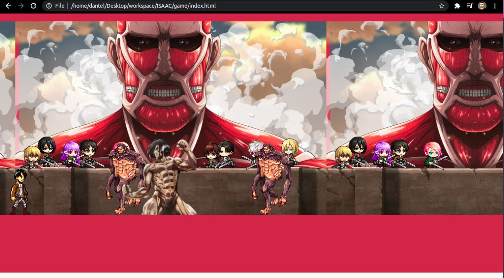

## Attack on Titan Run Game (HTML5 + CSS + JS)
  
> this project was developed in a Bootcamp of the Digital Innovation One, I just change some themes in the project. in this case that will based in the anime Attack on Titan.

*When your internet go off what is the first thing that happen in your browser? the classic dinossaur game! 
in this project I re-created this game in Attack on Titan theme.
this is a basic project there's missing a lot o things like the score board and the re-start buttom.*

